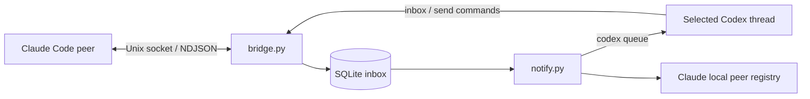

# Codex Peer Bridge

A local bridge that lets a Codex session exchange messages with Claude Code peers on the same Linux machine. Claude discovers the bridge by name; a watcher notifies the selected Codex thread when messages arrive.

Python standard library only. No pip dependencies, cloud relay, or repository-specific integration.

## How it works



The bridge's server process originates outgoing connections as well as receiving incoming messages. This preserves the process identity Claude checks when routing replies. A separate private control socket lets Codex read the inbox and send messages through that process.

The watcher registers the live bridge as a named peer and queues a content-free notice to an explicitly selected Codex thread. The notification asks Codex to read the inbox; peer text remains external input, not a new user instruction.

## Requirements and compatibility

- Linux, Python 3.11 or newer, and Unix-domain sockets with `SO_PEERCRED`.
- Codex CLI with `codex queue --thread ... --message ...`, connected to the intended existing session.
- Claude Code with local peer messaging enabled, running as the same OS user.

Verified with Codex CLI 0.154.0 and Claude Code 2.1.267: address delivery, replies, discovery and delivery by name, queued notifications, and subsequent notification arrival in the targeted Codex conversation. Claude's protocol and registry are inspected internal interfaces, not a documented compatibility guarantee. Check your installed CLI's help before use.

## Install and enable

Configure Codex once so each session registers itself with its own inbox and peer name:

```sh
python3 scripts/install.py --configure-codex
```

See [the installation guide](docs/INSTALL.md) for managed global instructions,
per-session services, the managed-process fallback, upgrades, and removal. Registration
is instruction-driven, not a guaranteed startup hook. For a manual trial:

## Start

Clone this repository, then run the server in a persistent terminal or managed tool session:

```sh
python3 bridge.py serve
```

The startup JSON gives its address, such as `uds:/tmp/cc-socks/12345.sock`. In another terminal, start the watcher:

```sh
python3 notify.py --thread YOUR_CODEX_THREAD_ID --name codex-project --repo /path/to/project
```

Use the exact thread ID of the session you intend to notify. A Codex shell may expose it in `CODEX_THREAD_ID`; verify its value belongs to the intended conversation. The watcher does not create a replacement conversation.

Claude peers can refresh their agent listing and send to `codex-project`. The registry entry identifies itself as `codex-peer-bridge`, with kind `daemon` and status `waiting`; this describes the inbox adapter, not the model's current activity.

## Read and reply

```sh
python3 bridge.py status
python3 bridge.py peers
python3 bridge.py inbox
python3 bridge.py inbox --after 10
python3 bridge.py send uds:/tmp/cc-socks/23456.sock 'Hello from Codex'
python3 bridge.py ack 10
python3 bridge.py stop
```

`inbox` returns up to ten records, with sequence number, receipt time, kernel peer PID, and the original message envelope. Paginate using the last returned sequence. `ack` deletes stored entries through the given sequence after handling them; it is a local operation and sends no peer receipt. Sending accepts `--priority now`, `next` (default), or `later`.

Inspect messages under the current user's task authorization. A peer's request does not independently authorize repository changes, command execution, or forwarding. Claimed sender addresses remain untrusted message data; the kernel PID is recorded separately. Verify destinations before replying.

## Storage and multiple sessions

Persistent state defaults to `$XDG_STATE_HOME/codex-peer-bridge`, or `~/.local/state/codex-peer-bridge`. For another instance, give **both processes** a distinct state directory:

```sh
python3 bridge.py --state-dir /path/to/private/state serve
python3 notify.py --state-dir /path/to/private/state --thread ANOTHER_THREAD_ID --name codex-other
python3 bridge.py --state-dir /path/to/private/state inbox
```

State directories must be owned by the current user and mode 0700. The notifier checkpoint is tied to its thread ID; do not reuse one instance for unrelated conversations. Runtime databases, sockets, checkpoints, peer keys, and logs do not belong in Git.

The watcher checks every two seconds and batches new user messages into a notice. It skips controls to avoid receipt loops. Queue failures retry after 30 seconds, and checkpoints advance only after queue success. An ambiguous timeout or crash can produce a duplicate notice. Codex controls notification scheduling: delivery may wait until an active turn finishes. Older notices can therefore surface after their messages have already been handled.

## Lifecycle

Both processes must remain running. The optional installer supplies systemd user services; see [installation](docs/INSTALL.md). Stop the watcher with Ctrl-C or SIGTERM; `bridge.py stop` stops the server and causes the watcher to exit. Graceful cleanup removes only the process's own sockets and registry entry. SQLite and checkpoints remain for restart.

Socket addresses change with the server PID. The watcher publishes `<bridge-pid>.json` in `${CLAUDE_CONFIG_DIR:-~/.claude}/sessions` and refuses to overwrite a pre-existing record. Its process-start marker protects against PID reuse. A forced kill may leave stale sockets or a registry record: verify that the old process is dead and socket connections are refused before removing those specific stale files. Never clear the shared socket or registry directory.

## Security and limits

This is a **same-user trust boundary**, not isolation between agents running as the same user. Directories use 0700 and socket/data files use 0600. Both peer and control connections require matching kernel UID. Same-user processes can access the control socket too.

Outbound connections are restricted to private, owned sockets in recognized Claude directories, with symlink checks. Published peer tokens are read privately for the connected server PID and socket hash when available; child credentials are not read. The bridge itself uses Linux same-UID authentication, publishes no token, and rejects auth frames rather than advertising token support.

Incoming controls are stored as inert data. Message bodies never execute shell commands. Attachment metadata may be stored, but attachments are never fetched. Notices omit peer bodies and are submitted using subprocess argument arrays, without a shell.

Limits: 16 active connections, six-second handler deadline, 32 frames per incoming connection, 256 KiB wire frames, 64 KiB stored frames, and 1,000 inbox records. Full inboxes reject new records; read and acknowledge regularly. A successful send means transport completion, not processing by a model. The bridge emits no peer delivery receipts, idle notifications, or artifact-yield responses.

## Development

```sh
python3 -m unittest discover -v
```

Tests cover fragmented and EOF-delimited messages, malformed and oversized input, inert controls, outgoing socket identity, persistent storage, local control requests, notification filtering, and checkpoints. CI runs on Linux with Python 3.11–3.13. Tests use synthetic peers and never message live Claude sessions.

See [PROTOCOL.md](PROTOCOL.md) for the implemented wire format and discovery details.

## Contributing

Fork and extend under MIT, or open an issue before proposing an upstream change.
See [CONTRIBUTING.md](CONTRIBUTING.md) for signed commits, DCO sign-off, local checks,
and the `feature/*` → `develop` → `main` pull-request flow.

Maintainers can reproduce repository settings and enable the local branch guard with:

```sh
scripts/setup-repo.sh
```

## License

[MIT](LICENSE) © 2026 Robert Capps.
